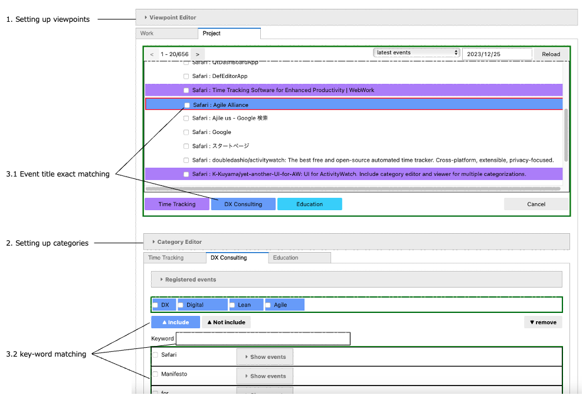
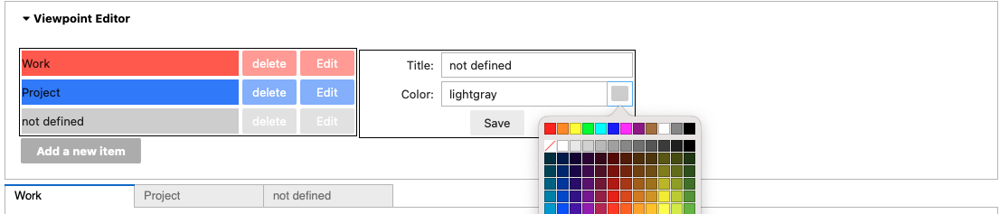
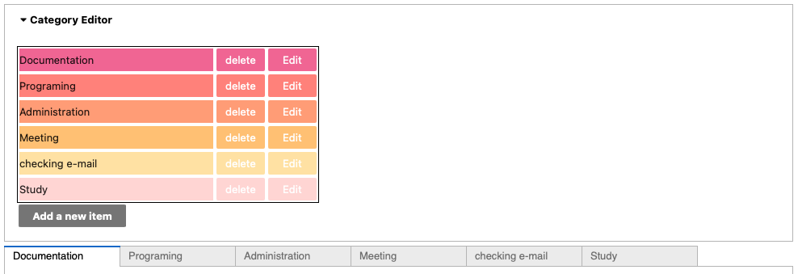
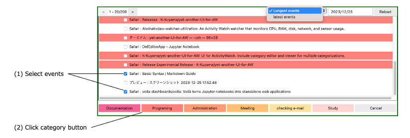
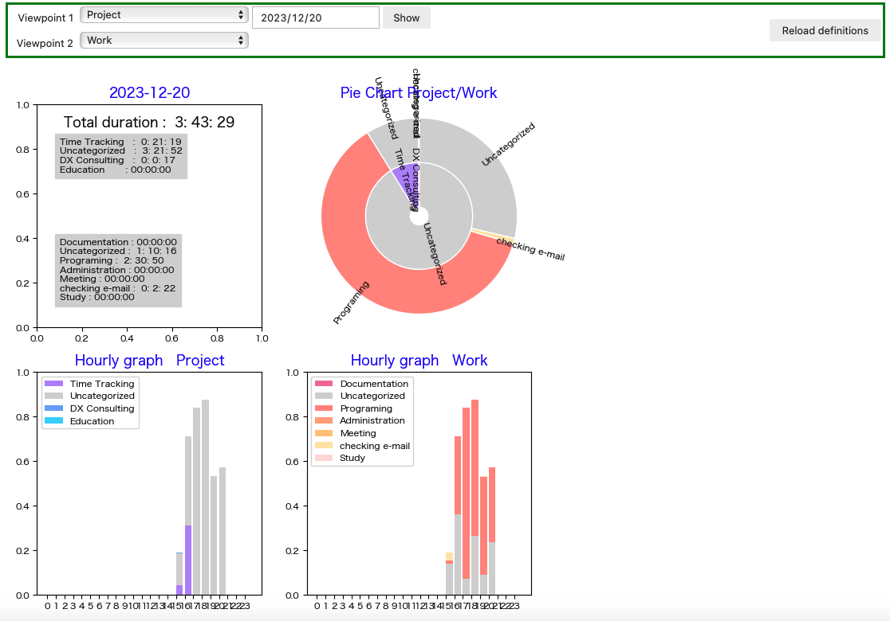

# Usage

## CategoryEditor
Category editor provides the functions "setting up viewpoints", "setting up categories for each viewpoint" and 
"Setting up categorization rules for each category".
All set up data is saved in "DefDB.db" as a SQLite database file.

### 1. Setting up viewpoints

- Open Viewpoint Editor.
- Click "Add a new item" button to add a new viewpoint. A new viewpoint tab appears.
- Click "Edit" button to open a property edit panel. Setting title and color for the viewpoint from the panel.
- Click "delete" button to delete the viewpoint.

### 2. Setting up categories

- Open Category Editor. You can add, edit and delete from this editor.

### 3. Setting up categorization rules

In this program, you can register strings that match events, and those strings are internally processed and converted into regular expressions. There are two methods for string matching.

#### 3.1 Event title exact matching

Registering whole event title strings on the "event selector". Enevt selector shows you all events in the desinated date as a list and you can select events you want to register for a category from the list.

#### 3.2 Key-word matching

Registering key-word that match events.
You can define a key-word by key input in the text-area, or selecting from key-word candidates.
Key-word candidates are picked up from the registered event title strings.
And you can register the key-word by clicking "include" or "not include" button. 
- `include` : matching the event include the key-word
- `not include` : matching the event not include the key-word 

## Dashboard

### 1. Input viewoints and date

- Select one or two viewpoint from the selector
- Select the date from the date picker
- Click "Show" button and just wait until graphs appear (Some time it takes a long time)

### 2. Reload CategoryEditor data

If you change categorization definitions by Category Editor, click "Reload definitions" button to reflect them.

